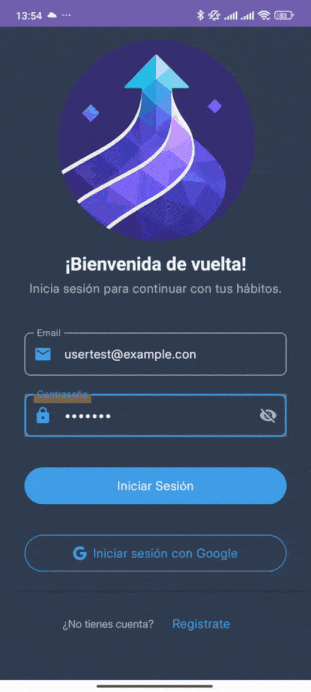
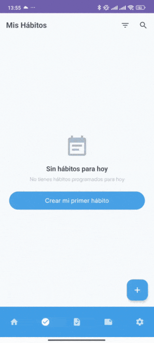
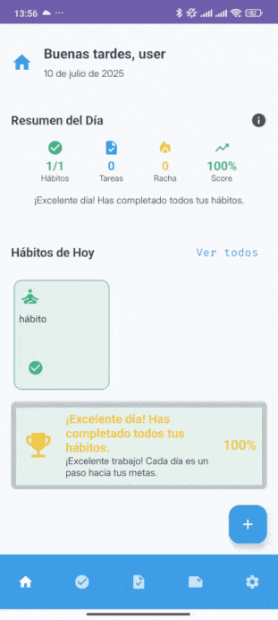

# HabitJourney Android


[Read it in English](README.md)

Aplicación Android nativa para la gestión de hábitos, tareas y notas, construida con Kotlin, Jetpack Compose y Firebase. Desarrollada como proyecto final del CFGS de Desarrollo de Aplicaciones Multiplataforma (DAM) 2025 en IES Los Albares.

---

## Índice

1. [Sobre el proyecto](#sobre-el-proyecto)
2. [Migración técnica reciente](#migración-técnica-reciente)
3. [Stack tecnológico](#stack-tecnológico)
4. [Funcionalidades principales](#funcionalidades-principales)
5. [Pantallas de la Aplicación](#pantallas-de-la-aplicación)
6. [Arquitectura del proyecto](#arquitectura-del-proyecto)
7. [Instalación y configuración](#instalación-y-configuración)
8. [Testing y calidad](#testing-y-calidad)
9. [Permisos requeridos](#permisos-requeridos)
10. [Internacionalización](#internacionalización)
11. [Próximas mejoras](#próximas-mejoras)
12. [Aprendizajes y enfoque personal](#aprendizajes-y-enfoque-personal)
13. [Contribuir](#contribuir)
14. [Contacto](#contacto)
15. [Licencia](#licencia)


## 🎯 Sobre el proyecto

HabitJourney es una app de productividad personal que integra tres funcionalidades principales: gestión de hábitos con seguimiento de rachas, tareas con recordatorios inteligentes, y notas simples y listas.

El proyecto comenzó como trabajo de fin de ciclo, pero continúa evolucionando como herramienta de aprendizaje y mejora continua. 

El objetivo es construir una app funcional, mantenible y escalable, priorizando la claridad del código y una arquitectura sólida.

## 🔄 Migración técnica reciente

Inicialmente, la aplicación se comunicaba con un [backend propio en Spring Boot](https://github.com/Alejandro-Araujo/habitjourney-backend) para la gestión de usuarios. Sin embargo, como decisión técnica orientada a simplificar la arquitectura y facilitar el mantenimiento, se ha migrado a **Firebase Authentication** y se está trabajando en la integración completa con **Firestore** para sincronización en la nube.

### Cambios principales:
- **Autenticación múltiple:** Email/contraseña y Google Sign-In
- **Sistema de reautenticación:** `ReauthenticationManager` con patrón Mixin
- **Verificación de email:** Flujo automático integrado
- **Monitoreo de consistencia:** Detección de cambios externos en la cuenta
- **Migración de datos:** User ID de Long a String para Firebase UID

## 🛠️ Stack tecnológico

### Arquitectura
- **Patrón:** Clean Architecture + MVVM
- **Modularización:** Por características (features)
- **Inyección de dependencias:** Hilt con KSP
- **Programación reactiva:** Coroutines + StateFlow

### Tecnologías principales
- **UI:** Jetpack Compose + Material 3
- **Autenticación:** Firebase Auth
- **Base de datos local:** Room (SQLite)
- **Navegación:** Navigation Compose
- **Notificaciones:** WorkManager + AlarmManager

### Características técnicas
- **Multiidioma:** Español, inglés, alemán, francés
- **Temas adaptativos:** Claro, oscuro y sistema
- **Compatibilidad:** Android 8.0+ (API 26-35)

## 📱 Funcionalidades principales

### Hábitos
- Frecuencias flexibles: diaria o días específicos
- Seguimiento de rachas
- Estados: completado, saltado, pendiente

### Tareas
- Fechas de vencimiento con recordatorios
- Notificaciones con acciones rápidas (completar/posponer)
- Prioridades visuales

### Notas
- Dos tipos: texto libre o listas con checkboxes
- Sistema de favoritos y archivado
- Búsqueda por contenido
- Interfaz simple y directa

### Dashboard
- Resumen diario con progreso visual
- Estadísticas de hábitos completados y tareas pendientes
- Acceso rápido a elementos del día

### Configuración
- Gestión de perfil y verificación de email
- Cambio de tema e idioma
- Actualización de contraseña con reautenticación
- Eliminación de cuenta

## 🖼️ Pantallas de la Aplicación







## 🏗️ Arquitectura del proyecto

```
app/
├── core/
│   ├── data/           # Room, enums, configuración
│   ├── presentation/   # Temas, estilos, componentes comunes
│   ├── di/             # Módulos de Hilt
│   └── utils/          # Logging, providers, utilidades
│
├── features/           # Módulos por característica
│   ├── dashboard/      # Vista resumen
│   ├── settings/       # Configuración y perfil
│   ├── habit/          # Gestión de hábitos
│   ├── task/           # Tareas y notificaciones
│   ├── note/           # Notas y listas
│   └── user/           # Autenticación
│
├── navigation/
│   ├── AuthFlowCoordinator  # Coordinador de autenticación
│   ├── HabitJourneyApp      # Estructura general
│   ├── NavGraph             # Navegación principal
│   └── Screen               # Definición de rutas
│
├── MainActivity
└── HabitJourneyApplication
```

Cada feature sigue la estructura: `data/`, `domain/`, `presentation/`, `di/`

## 🔧 Instalación y configuración

### Requisitos
- Android Studio Koala (2024.1.1) o superior
- JDK 17
- Android SDK con compileSdk 35, minSdk 26

### Configuración Firebase
1. Crear proyecto en [Firebase Console](https://console.firebase.google.com/)
2. Añadir aplicación Android con package `com.habitjourney.app`
3. Habilitar Authentication (Email/Password y Google)
4. Descargar `google-services.json` y colocarlo en `app/`
5. Configurar SHA-1 y SHA-256 para Google Sign-In

### Ejecución
```bash
git clone https://github.com/Alejandro-Araujo/habitjourney-android.git
cd habitjourney-android
# Abrir en Android Studio y sincronizar Gradle
```

## 🧪 Testing y calidad

```bash
# Tests unitarios
./gradlew testDebugUnitTest

# Tests instrumentados
./gradlew connectedAndroidTest

# Análisis de código
./gradlew lintDebug
```

GitHub Actions configurado para CI/CD con ejecución automática de tests y análisis estático en cada push.

## 🔐 Permisos requeridos

```xml
<!-- Notificaciones -->
<uses-permission android:name="android.permission.POST_NOTIFICATIONS" />

<!-- Alarmas exactas (Android 12+) -->
<uses-permission android:name="android.permission.SCHEDULE_EXACT_ALARM" />
<uses-permission android:name="android.permission.USE_EXACT_ALARM" />

<!-- Arranque del dispositivo -->
<uses-permission android:name="android.permission.RECEIVE_BOOT_COMPLETED" />

<!-- Conectividad -->
<uses-permission android:name="android.permission.INTERNET" />
```

## 🌍 Internacionalización

Soporte para 4 idiomas:
- 🇪🇸 Español (por defecto)
- 🇬🇧 Inglés
- 🇩🇪 Alemán
- 🇫🇷 Francés

## 📈 Próximas mejoras

### Técnicas
- [ ] Integración completa con Firestore
- [ ] Estadísticas avanzadas con gráficos
- [ ] Optimización de rendimiento

### Funcionales
- [ ] Sistema de logros opcional
- [ ] Exportación de datos

## 📚 Aprendizajes y enfoque personal

Este proyecto me ha permitido aplicar y consolidar conocimientos del ciclo DAM:

- Arquitectura modular y mantenible
- Autenticación segura con Firebase
- UI reactiva con Jetpack Compose
- Gestión de estado con MVVM
- Integración de servicios cloud
- Flujos de trabajo profesionales con Git

El objetivo no ha sido crear una app comercial, sino una base sólida que demuestre competencias técnicas y capacidad de evolución.

## 🤝 Contribuir

Si encuentras bugs o tienes sugerencias:

1. Fork el proyecto
2. Crear rama feature (`git checkout -b feature/mejora`)
3. Commit cambios (`git commit -m 'Añadir mejora'`)
4. Push a la rama (`git push origin feature/mejora`)
5. Crear Pull Request

## 📞 Contacto

**Alejandro Araujo Fernández**
- 📧 Email: [jandroaraujo@gmail.com](mailto:jandroaraujo@gmail.com)
- 💼 LinkedIn: [alejandro-araujo-fernandez](https://www.linkedin.com/in/alejandro-araujo-fernandez/)
- 💻 GitHub: [@Alejandro-Araujo](https://github.com/Alejandro-Araujo)

## 📝 Licencia

Este proyecto está bajo la Licencia MIT - consulta el archivo [LICENSE](LICENSE) para más detalles.

---

*Desarrollado en Murcia, España como proyecto final DAM 2025*