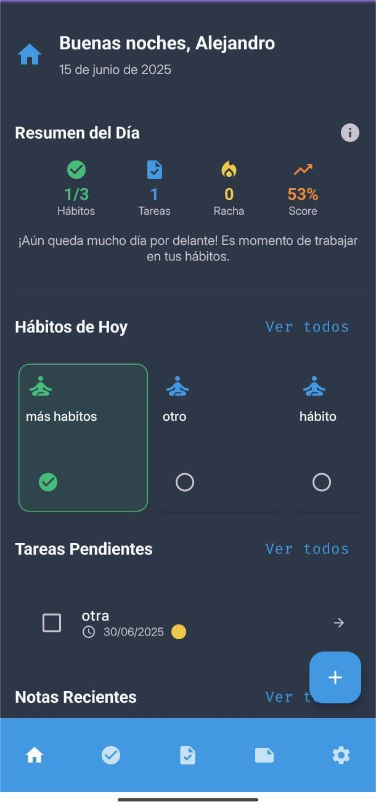
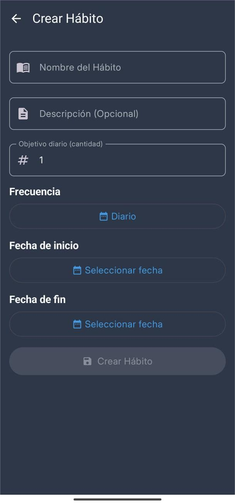
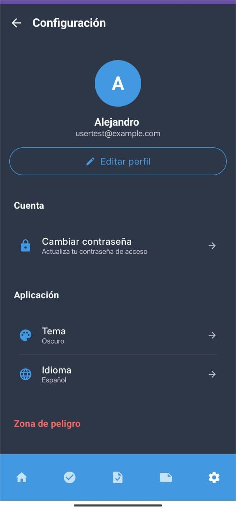

# HabitJourney Android


Aplicación Android de productividad personal que integra gestión de hábitos, tareas y notas, desarrollada con Kotlin y Jetpack Compose.

Proyecto final para el CFGS de Desarrollo de Aplicaciones Multiplataforma (DAM) 2025 en IES Los Albares

## 🚀 Características

- ✅ **Gestión de Hábitos** con seguimiento de rachas
- 📋 **Tareas** con recordatorios y notificaciones
- 📝 **Notas** simples y listas
- 📊 **Dashboard** con estadísticas diarias
- 🌍 **Multiidioma** (ES, EN, DE, FR)
- 🎨 **Temas** claro, oscuro y del sistema
- 📱 **Offline-first** con sincronización selectiva
- 🔔 **Notificaciones** con acciones rápidas

## 📋 Requisitos

- Android Studio Koala (2024.1.1) o superior
- JDK 17
- Android SDK con:
    - compileSdk 35 (Android 15)
    - minSdk 26 (Android 8.0 Oreo)
    - targetSdk 35
- Kotlin 1.9.x

## 🔧 Instalación

### 1. Clonar el repositorio

```bash
git clone https://github.com/Alejandro-Araujo/habitjourney-android.git
cd habitjourney-android
```

### 2. Configurar el backend

La aplicación está preconfigurada para usar el backend en producción.

Para desarrollo local, puedes modificar el `build.gradle.kts`:

```kotlin
buildTypes {
    debug {
        // Para desarrollo local con emulador
        buildConfigField("String", "API_BASE_URL", "\"http://10.0.2.2:8080/api/\"")
        
        // Para producción (configuración actual)
        // buildConfigField("String", "API_BASE_URL", "\"https://habitjourney-backend.onrender.com/api/\"")
    }
}
```

**Nota:** El backend ya está desplegado en Render, por lo que no es necesario ejecutarlo localmente a menos que quieras hacer cambios en el servidor.

### 3. Sincronizar y ejecutar

1. Abrir el proyecto en Android Studio
2. Sincronizar Gradle (`File > Sync Project with Gradle Files`)
3. Ejecutar en emulador o dispositivo físico

## 🏗️ Arquitectura

El proyecto sigue **Clean Architecture + MVVM** con modularización por features:

```
features/
├── dashboard/      # Panel principal y estadísticas
├── habit/          # Gestión de hábitos
├── task/           # Gestión de tareas y recordatorios
├── note/           # Gestión de notas
├── user/           # Autenticación y perfil
└── settings/       # Configuración de la app

Cada feature contiene:
├── data/          # DAOs, entities, repositories
├── domain/        # Modelos, casos de uso
├── presentation/  # UI (Screens, ViewModels, States)
└── di/           # Inyección de dependencias
```

## 🛠️ Tecnologías Utilizadas

### Core
- **UI:** Jetpack Compose + Material3
- **Arquitectura:** MVVM + Clean Architecture
- **DI:** Hilt (KSP)
- **Base de datos:** Room
- **Red:** Retrofit + OkHttp + Gson
- **Navegación:** Navigation Compose
- **Async:** Coroutines + Flow

### Adicionales
- **Notificaciones:** AlarmManager + WorkManager
- **Persistencia:** DataStore Preferences
- **Fecha/Hora:** Kotlinx DateTime
- **UI Utilities:** Accompanist SystemUIController

## 📱 Funcionalidades Principales

### Dashboard
- Saludo personalizado
- Estadísticas del día (hábitos completados, tareas pendientes)
- Progreso diario con cálculo detallado
- Acceso rápido a hábitos y tareas del día

### Hábitos
- Frecuencias: diaria o días específicos de la semana
- Seguimiento automático de rachas
- Estados: completado, saltado, pendiente
- Archivo sin pérdida de histórico

### Tareas
- Fechas y horas de vencimiento
- Recordatorios con notificaciones push
- Acciones desde notificación: Completar o Posponer (5/15 min)
- Prioridades visuales
- Soporte para alarmas exactas (Android 12+)

### Notas
- Tipos: texto simple o listas
- Favoritos
- Búsqueda
- Archivo y eliminación

### Configuración
- Cambio de tema (claro/oscuro/sistema)
- Selección de idioma
- Actualización de perfil
- Cambio de contraseña
- Eliminación de cuenta

## Capturas de pantalla
  
 

## 🔐 Permisos Requeridos

```xml
<!-- Notificaciones -->
<uses-permission android:name="android.permission.POST_NOTIFICATIONS" />

<!-- Alarmas exactas para recordatorios -->
<uses-permission android:name="android.permission.SCHEDULE_EXACT_ALARM" />
<uses-permission android:name="android.permission.USE_EXACT_ALARM" />

<!-- Iniciar al arranque del dispositivo -->
<uses-permission android:name="android.permission.RECEIVE_BOOT_COMPLETED" />

<!-- Internet -->
<uses-permission android:name="android.permission.INTERNET" />
```

## 🧪 Testing

```bash
# Tests unitarios
./gradlew test

# Tests instrumentados
./gradlew connectedAndroidTest
```

## 🚀 Compilación Release

1. Generar keystore:
```bash
keytool -genkey -v -keystore release-key.jks -keyalg RSA -keysize 2048 -validity 10000 -alias my-alias
```

2. Configurar signing en `app/build.gradle.kts`

3. Generar APK:
```bash
./gradlew assembleRelease
```

## 📱 Compatibilidad

- **Versión mínima:** Android 8.0 (API 26) - Oreo
- **Versión objetivo:** Android 15 (API 35)
- **Cobertura de mercado:** ~95% de dispositivos Android
- **Orientación:** Portrait (principalmente)

## 🌐 Internacionalización

La app soporta 4 idiomas:
- 🇪🇸 Español (por defecto)
- 🇬🇧 Inglés
- 🇩🇪 Alemán
- 🇫🇷 Francés

Los archivos de traducción están en `res/values-{idioma}/strings.xml`

## 🐛 Problemas Conocidos

- En Android 14+, los permisos de notificaciones exactas requieren aprobación manual
- El tema del sistema puede requerir reinicio en algunos dispositivos

## 🤝 Contribuir

1. Fork el proyecto
2. Crear rama feature (`git checkout -b feature/NuevaCaracteristica`)
3. Commit cambios (`git commit -m 'Añadir nueva característica'`)
4. Push a la rama (`git push origin feature/NuevaCaracteristica`)
5. Crear Pull Request

## 📝 Licencia

Este proyecto está bajo la Licencia MIT - ver [LICENSE](LICENSE) para detalles.

## 👥 Autor

- **[Alejandro Araujo Fernández]** - [GitHub](https://github.com/Alejandro-Araujo)

## 📞 Contacto

- Email: [jandroaraujo@gmail.com]
- LinkedIn: [https://www.linkedin.com/in/alejandro-araujo-fernandez/]
