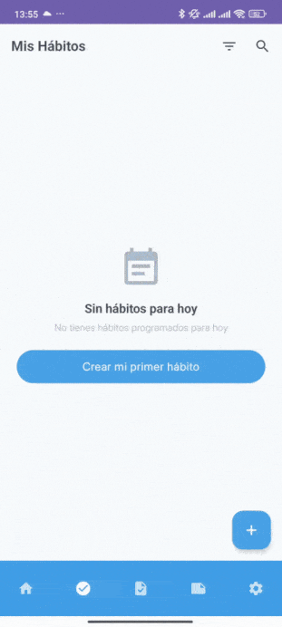
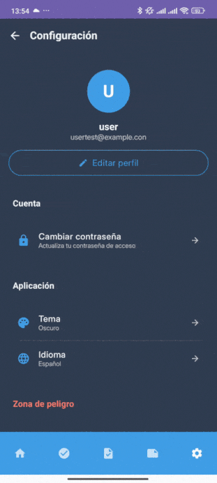

# HabitJourney Android


[Leer en Español](README.es.md)

Native Android application for habit management, tasks and notes, built with Kotlin, Jetpack Compose and Firebase. Developed as a final project for the Advanced Vocational Training in Cross-Platform Software Development (DAM) 2025 at IES Los Albares.

---

## Table of Contents

1. [About the project](#about-the-project)
2. [Recent technical migration](#recent-technical-migration)
3. [Tech stack](#tech-stack)
4. [Main features](#main-features)
5. [App Demos](#app-demos)
6. [Project architecture](#project-architecture)
7. [Installation and setup](#installation-and-setup)
8. [Testing and quality](#testing-and-quality)
9. [Required permissions](#required-permissions)
10. [Internationalization](#internationalization)
11. [Upcoming improvements](#upcoming-improvements)
12. [Learning and personal approach](#learning-and-personal-approach)
13. [Contributing](#contributing)
14. [Contact](#contact)
15. [License](#license)

## 🎯 About the project

HabitJourney is a personal productivity app that integrates three main functionalities: habit management with streak tracking, tasks with smart reminders, and simple notes and lists.

The project started as an final project for my degree, but it continues to evolve as a tool for learning and continuous improvement. The philosophy is to build a functional, maintainable, and scalable app, prioritizing code clarity and a robust architecture.

## 🔄 Recent technical migration

Initially, the application communicated with a [backend propio en Spring Boot](https://github.com/Alejandro-Araujo/habitjourney-backend) for user management. However, as a technical decision aimed at simplifying the architecture and facilitating maintenance, it has been migrated to **Firebase Authentication**, and work is underway on full integration with **Firestore** for cloud synchronization.

### Main changes:
- **Multiple authentication:** Email/password and Google Sign-In
- **Re-authentication system:** `ReauthenticationManager` with Mixin pattern
- **Email verification:** Integrated automatic flow
- **Consistency monitoring:** Detection of external account changes
- **Data migration:** User ID from Long to String for Firebase UID

## 🛠️ Tech stack

### Architecture
- **Pattern:** Clean Architecture + MVVM
- **Modularization:** By features
- **Dependency injection:** Hilt with KSP
- **Reactive programming:** Coroutines + StateFlow

### Main technologies
- **UI:** Jetpack Compose + Material 3
- **Authentication:** Firebase Auth
- **Local database:** Room (SQLite)
- **Navigation:** Navigation Compose
- **Notifications:** WorkManager + AlarmManager

### Technical features
- **Multi-language:** Spanish, English, German, French
- **Adaptive themes:** Light, dark and system
- **Compatibility:** Android 8.0+ (API 26-35)

## 📱 Main features

### Habits
- Flexible frequencies: daily or specific days
- Streak tracking with smart recovery
- States: completed, skipped, pending
- Archive without history loss

### Tasks
- Due dates with reminders
- Notifications with quick actions (complete/postpone)
- Visual priorities
- Support for exact alarms (Android 12+)

### Notes
- Two types: free text or lists with checkboxes
- Favorites and archive system
- Content search
- Simple and direct interface

### Dashboard
- Daily summary with visual progress
- Statistics of completed habits and pending tasks
- Quick access to day elements

### Settings
- Profile management and email verification
- Theme and language change
- Password update with re-authentication
- Account deletion

## 🖼️ App Demos







## 🏗️ Project architecture

```
app/
├── core/
│   ├── data/           # Room, enums, configuration
│   ├── presentation/   # Themes, styles, common components
│   ├── di/             # Hilt modules
│   └── utils/          # Logging, providers, utilities
│
├── features/           # Feature modules
│   ├── dashboard/      # Summary view
│   ├── settings/       # Configuration and profile
│   ├── habit/          # Habit management
│   ├── task/           # Tasks and notifications
│   ├── note/           # Notes and lists
│   └── user/           # Authentication
│
├── navigation/
│   ├── AuthFlowCoordinator  # Authentication coordinator
│   ├── HabitJourneyApp      # General structure
│   ├── NavGraph             # Main navigation
│   └── Screen               # Route definitions
│
├── MainActivity
└── HabitJourneyApplication
```

Each feature follows the structure: `data/`, `domain/`, `presentation/`, `di/`

## 🔧 Installation and setup

### Requirements
- Android Studio Koala (2024.1.1) or higher
- JDK 17
- Android SDK with compileSdk 35, minSdk 26

### Firebase configuration
1. Create project in [Firebase Console](https://console.firebase.google.com/)
2. Add Android application with package `com.habitjourney.app`
3. Enable Authentication (Email/Password and Google)
4. Download `google-services.json` and place it in `app/`
5. Configure SHA-1 and SHA-256 for Google Sign-In

### Execution
```bash
git clone https://github.com/Alejandro-Araujo/habitjourney-android.git
cd habitjourney-android
# Open in Android Studio and sync Gradle
```

## 🧪 Testing and quality

```bash
# Unit tests
./gradlew testDebugUnitTest

# Instrumented tests
./gradlew connectedAndroidTest

# Code analysis
./gradlew lintDebug
```

GitHub Actions configured for CI/CD with automatic test execution and static analysis on each push.

## 🔐 Required permissions

```xml
<!-- Notifications -->
<uses-permission android:name="android.permission.POST_NOTIFICATIONS" />

<!-- Exact alarms (Android 12+) -->
<uses-permission android:name="android.permission.SCHEDULE_EXACT_ALARM" />
<uses-permission android:name="android.permission.USE_EXACT_ALARM" />

<!-- Device boot -->
<uses-permission android:name="android.permission.RECEIVE_BOOT_COMPLETED" />

<!-- Connectivity -->
<uses-permission android:name="android.permission.INTERNET" />
```

## 🌍 Internationalization

Support for 4 languages:
- 🇪🇸 Spanish (default)
- 🇬🇧 English
- 🇩🇪 German
- 🇫🇷 French

## 📈 Upcoming improvements

### Technical
- [ ] Full integration with Firestore
- [ ] Advanced statistics with charts
- [ ] Performance optimization

### Functional
- [ ] Optional achievement system
- [ ] Data export

## 📚 Learning and personal approach

This project has allowed me to apply and consolidate knowledge from the DAM cycle:

- Modular and maintainable architecture
- Secure authentication with Firebase
- Reactive UI with Jetpack Compose
- State management with MVVM
- Cloud service integration
- Professional workflows with Git

The goal has not been to create a commercial app, but a solid foundation that demonstrates technical competencies and capacity for evolution.

## 🤝 Contributing

If you find bugs or have suggestions:

1. Fork the project
2. Create feature branch (`git checkout -b feature/improvement`)
3. Commit changes (`git commit -m 'Add improvement'`)
4. Push to branch (`git push origin feature/improvement`)
5. Create Pull Request

## 📞 Contact

**Alejandro Araujo Fernández**
- 📧 Email: [jandroaraujo@gmail.com](mailto:jandroaraujo@gmail.com)
- 💼 LinkedIn: [alejandro-araujo-fernandez](https://www.linkedin.com/in/alejandro-araujo-fernandez/)
- 💻 GitHub: [@Alejandro-Araujo](https://github.com/Alejandro-Araujo)

## 📝 License

This project is under the MIT License - see the [LICENSE](LICENSE) file for details.

---

*Developed in Murcia, Spain as DAM 2025 final project*